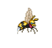

# FROG FEAST

## Table of Contents
  - [Overview](#overview)
  - [Features](#features)
  - [Technologies used](#technologies-used)
  - [Local Deployment](#local-deployment)
  - [Mechanis](#mechanics)
    - [Controls](#controls)
    - [The Bugs](#the-bugs)
  - [Issues](#issues)
  - [About Me](#about-me)

## Overview

Welcome to Frog Feast!

Check out the deployed version [HERE](https://lemonstener.github.io/frog-feast/)

Music by [Bensound](https://www.bensound.com/royalty-free-music/2)

 This game starring a glutinous amphibian is my submission for [Mintbean](https://mintbean.io/meets?sort=upcoming)'s August Hiring Hackaton. 
 
 Bugs will come from your left and right and you must stick your tongue out at the right time to eat them and increase your score and (sometimes) time limit. Be wary of bees, eating one will hurt you and lower your score. Eat three bees and it's game over. Run out of time and it's also game over.

## Features
 - high score mechanic
 - mobile support (almost as good as the desktop version)

## Technologies used

No fancy frameworks or libraries used, just plain CSS and Javascript.

## Local Deployment

Since there are no libraries or frameworks involved the app does not require installing or setting anything up. Simply clone the repo in a folder on your computer, navigate to that folder and open **index.html**. 

### Controls

 - Pressing the **left** key lets you stick your tongue out to the left.
Or you can alternatively click the general left direction on the screen (or tap on mobile).

 - Pressing the **right** key lets you stick your tongue out to the right.
Or you can alternatively click the general right direction on the screen (or tap on mobile)

.

 - Pressing the **space bar** will toggle the music on and off. You may also just click on the speaker icon to achieve the same thing.

(Gosh, this image is huge.)

### The Bugs

 - Flies are the most common type and you'll receive 100 points for each one you manage to eat.
  

 - Fluffy bugs are the rarest and will give you 1000 points as well as increase your timer by 5 seconds.

 - Bees are nasty and you do not want to eat them! Each one will decrease your score by 100 points and take out one your lives. Cats may have 9 lives but this frog only has 3.

### Issues

 - On very rare occassions eating a bee will only decrease your score but not hurt you. Consider this my generosity to you.

### About me

My name is Deyan, a Web Developer / Software Engineer and currently a bootcamp student with Springboard, on track to graduate in late 2021. I enjoy all stacks of Web Development but Javascript and SQL are what I gravitate to the most. Feel free to connect with me on [LinkedIn](https://www.linkedin.com/in/deyan-vasilev/). 

I am open for junior to intermidiate positions in Front, Back or Full Stack development. I am open to work in the Greater St. Louis area, California as well as remote but I would be willing to relocate if the opportunity is right. 
